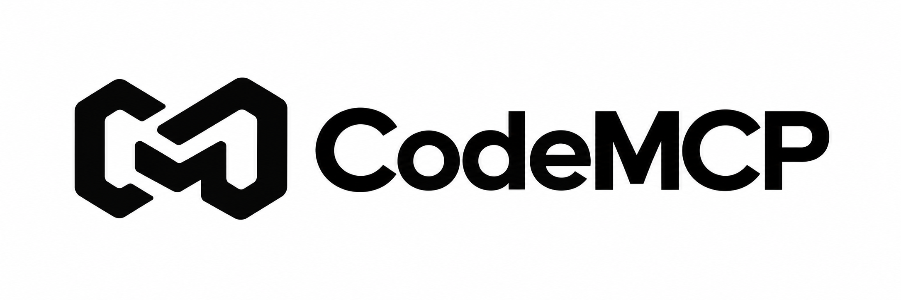
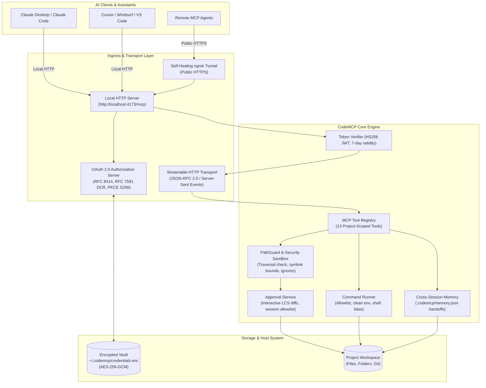

<p align="center">
  <a href="https://code-mcp.vercel.app/">
    
  </a>
</p>

<div align="center">

# CodeMCP

**The Project-Scoped Model Context Protocol Server for Local Codebases**

[](https://www.npmjs.com/package/@mahesh2-lab/codemcp)
[](https://code-mcp.vercel.app/)
[](https://modelcontextprotocol.io/)
[](https://nodejs.org/)
[](tests/)
[](LICENSE)

<p align="center">
  Connect AI assistants and MCP clients to your local project with authenticated Streamable HTTP,<br>
  strict security sandboxing, interactive git-diff approvals, cross-session memory, and zero-config tunneling.
</p>

<p align="center">
  <a href="#-architecture">Architecture</a> •
  <a href="#-quick-start">Quick Start</a> •
  <a href="#-client-integrations">Client Setup</a> •
  <a href="#-mcp-tools">Tools Reference</a> •
  <a href="#-interactive-approvals">Approvals</a> •
  <a href="#-security-model">Security</a> •
  <a href="#-authentication--oauth-20">OAuth 2.0</a> •
  <a href="#-cli-reference">CLI</a>
</p>

</div>

---

## ⚡ Overview

When using AI coding assistants (like Claude, Cursor, Windsurf, or custom agents), providing direct access to your local machine presents a dilemma:

- **Too little access**: AI assistants can only see snippets you paste manually, missing surrounding context, dependency trees, and project conventions.
- **Unrestricted access**: Giving AI unrestricted shell or filesystem access risks accidental deletions, credential leaks (`.env`), or uncontrolled code execution.

**CodeMCP** bridges this gap. It is a lightweight, project-scoped [Model Context Protocol (MCP)](https://modelcontextprotocol.io/) server that bounds the assistant's operational scope strictly to the project directory you choose. It provides authenticated Streamable HTTP transport, self-healing public tunneling (via ngrok), interactive human-in-the-loop review with unified git diffs, cross-assistant session memory, and a hardened security sandbox.

---

## 🏗️ Architecture



---

## 🌟 Key Features

- **Strict Project Scoping**: Assistants can only inspect and modify files inside the specified project root. Directory traversals (`../`), symlink escapes, and absolute path escapes are blocked.
- **Interactive Human-in-the-Loop Review**: Real-time terminal approvals show unified git-style LCS diffs for edits and writes. Approve once (`y`), always allow for the session (`a`), reject (`n`), view full diff (`d`), or cancel (`q`).
- **Authenticated Streamable HTTP**: Full OAuth 2.0 implementation with Dynamic Client Registration (RFC 7591), RFC 8414 discovery, RFC 9728 protected resource metadata, PKCE S256, and long-lived 7-day tokens.
- **Cross-Assistant Session Memory**: Persistent handoff notes and rolling activity journals (`.codemcp/memory.json`) enable seamless collaboration across multiple AI assistants and sessions.
- **Fast Code Search**: Built-in ripgrep engine with automatic fallback to an asynchronous JavaScript walker, respecting `.mcpignore` and `.gitignore`.
- **Zero-Bloat Runtime**: Built with native Node.js 18+ standard libraries (native crypto, native fetch, native test runner) without heavy framework bloat.
- **Encrypted Credential Vault**: Stores OAuth client registrations, signing keys, and ngrok tokens safely in `~/.codemcp/credentials.enc` with AES-256-GCM encryption.
- **Self-Healing Tunneling**: Automatically cleans up orphaned ngrok sessions, recovers from stale connections, and rebinds ports gracefully across restarts.

---

## 🚀 Quick Start

### 1. Zero-Install with `npx`

From your project directory:

```bash
# Start with a secure public HTTPS tunnel (ideal for remote clients like Claude):
npx @mahesh2-lab/codemcp

# Or start for local-only access:
npx @mahesh2-lab/codemcp --no-tunnel
```

On launch, CodeMCP outputs your server connection details:

```text
┌─  CodeMCP Project Agent (MCP)  ──────────────────────────────────┐
│                                                                  │
│  Project    : my-app (my-app-id)                                 │
│  Root       : /Users/dev/projects/my-app                         │
│  Config     : codemcp.json                                       │
│  Permission : Read & Write                                       │
│  Approval   : Enabled (Ask before changes)                       │
│  Context    : CONTEXT.md                                         │
│  Password   : a1b2c3d4e5f67890 (auto-generated, saved to vault)  │
│  Local URL  : http://localhost:4173/mcp                          │
│  Global URL : https://abc-123.ngrok-free.app/mcp                 │
│                                                                  │
└──────────────────────────────────────────────────────────────────┘
  Waiting for AI client requests... (tool activity appears below)
```

### 2. Global Installation

```bash
npm install --global @mahesh2-lab/codemcp

# Run in current directory
codemcp

# Or specify a custom project directory
codemcp ./path/to/project --no-tunnel
```

---

## 🤖 Client Integrations

### Claude Desktop

Edit your `claude_desktop_config.json`:

- **macOS**: `~/Library/Application Support/Claude/claude_desktop_config.json`
- **Windows**: `%APPDATA%\Claude\claude_desktop_config.json`
- **Linux**: `~/.config/Claude/claude_desktop_config.json`

```json
{
  "mcpServers": {
    "my-project": {
      "command": "npx",
      "args": [
        "-y",
        "@mahesh2-lab/codemcp",
        "--no-tunnel",
        "/absolute/path/to/my-project"
      ]
    }
  }
}
```

### Cursor & Windsurf

1. Open **Settings** → **MCP Servers**.
2. Add a new server:
   - **Type**: `HTTP` / `Streamable HTTP`
   - **URL**: `http://localhost:4173/mcp` (or your ngrok Global URL)
3. When prompted for authorization, enter the **Owner Password** displayed in the CodeMCP terminal.

### Remote Claude AI / Custom Clients

1. Ensure the server is running with the public tunnel enabled (`codemcp`).
2. Register the **Global URL** (`https://<domain>.ngrok-free.app/mcp`) in your remote assistant.
3. The client will automatically negotiate Dynamic Client Registration and open the `/authorize` consent screen.
4. Input the **Owner Password** to grant access. Tokens remain valid for 7 days.

---

## 🧰 MCP Tools Reference

CodeMCP registers up to 13 project-scoped tools based on the configured permission level (`read`, `write`, or `both`).

| Tool                  | Inputs                                                        | Description & Safety Boundaries                                                                                        |
| :-------------------- | :------------------------------------------------------------ | :--------------------------------------------------------------------------------------------------------------------- |
| `get_project_context` | _(none)_                                                      | Returns full project metadata, description, `CONTEXT.md` guidelines, latest handoff note, and recent action journal.   |
| `list_files`          | `path?`, `maxFiles?`                                          | Recursively enumerates project files up to 10,000 files. Automatically filters ignored files and directories.          |
| `find_file`           | `pattern`, `path?`, `maxResults?`                             | Searches for files by glob or filename (e.g. `*.ts`, `src/**/test*`). Respects `.mcpignore`.                           |
| `read_file`           | `path`                                                        | Reads text files up to 10 MB. Blocks binary files, credentials, and sensitive configurations.                          |
| `search_code`         | `query`, `path?`, `isRegex?`, `caseSensitive?`, `maxResults?` | Fast code search using ripgrep. Query limited to 500 chars, file size capped at 2 MB to prevent event-loop stalls.     |
| `write_file`          | `path`, `content`, `summary?`                                 | Creates or overwrites a project file. Triggers interactive LCS diff approval if approval mode is active.               |
| `edit_file`           | `path`, `oldText`, `newText`, `replaceAll?`, `summary?`       | Performs precise textual replacements in files up to 10 MB. Shows before/after diff for confirmation.                  |
| `delete_file`         | `path`, `summary?`                                            | Deletes a file. Requires confirmation in `always` and `destructive` approval modes. Protected files cannot be deleted. |
| `execute_command`     | `command?` or `binary` + `args?`, `timeoutMs?`, `summary?`    | Runs an allowlisted binary with `shell: false`, clean environment, and 1-60s timeout (default 30s).                    |
| `record_memory`       | `summary`, `decisions?`, `nextSteps?`                         | Persists a handoff note in `.codemcp/memory.json` for subsequent assistants and sessions.                              |
| `get_memory`          | _(none)_                                                      | Retrieves the current handoff note and rolling action journal.                                                         |
| `ask_question`        | `question`, `options?`                                        | Asks the user an interactive question via MCP elicitation protocol.                                                    |
| `finish`              | `summary`, `success?`, `nextSteps?`                           | Marks an AI task complete and outputs a structured final summary.                                                      |

> [!NOTE]
> All tool responses are returned in dual format: machine-readable `structuredContent` and an LLM-friendly `content` text block. Responses exceeding **250 KB** are safely truncated to protect the model's context window.

---

## 🛡️ Interactive Approvals

CodeMCP puts you firmly in control of what code changes touch your disk.

```text
┌─ Action Approval Required ───────────────────────────────────────┐
│ Action    : WRITE                                                │
│ Target    : src/routes/api.js                                    │
│ Summary   : Add authentication check to user endpoint            │
├──────────────────────────────────────────────────────────────────┤
--- old
+++ new
@@ -10,3 +10,6 @@
 export function handleUser(req, res) {
+  if (!req.user) {
+    return res.status(401).json({ error: "Unauthorized" });
+  }
   return res.json(req.user);
 }
└──────────────────────────────────────────────────────────────────┘

Approve this action?
 [y] Allow once      [a] Always allow for session
 [n] Reject          [d] View full diff       [q] Cancel
```

### Approval Modes

1. **`always` / `true` (Default)**: Prompts for all file writes, file edits, file deletions, and command executions.
2. **`destructive`**: Prompts **only** for potentially destructive operations (`delete_file` and `execute_command`). File edits and writes apply automatically.
3. **`never` / `false`**: Disables confirmation prompts completely.

### Controlling Approvals

```bash
# Start with destructive-only approval
codemcp --approval destructive

# Disable approval prompts for this run
codemcp --no-approval

# Permanently persist approval preference in codemcp.json
codemcp approval on
codemcp approval off
```

---

## 🔒 Security Model & Sandboxing

CodeMCP enforces defense-in-depth across the filesystem, process execution, and network layers:

### 1. Filesystem Containment (`PathGuard`)

- **Lexical Sanitization**: Normalizes all incoming paths to POSIX format, strips null bytes, and verifies that the canonical resolved path strictly resides within the project root.
- **Symlink Defense**: Resolves symlink targets through realpath analysis to prevent escaping outside the project root.
- **Protected Files**: Deletion of critical files (`codemcp.json`, `package.json`, `package-lock.json`, `.git`, `.gitignore`, `.mcpignore`, `CONTEXT.md`) is blocked by default.

### 2. Forbidden Secret Patterns

Automatic exclusion of sensitive files across all read, list, and search tools:

- Environment configurations: `.env`, `.env.*`, `.env.local`
- Version control & server state: `.git`, `.codemcp`, `node_modules`
- Cryptographic keys: `.ssh`, `id_rsa`, `id_ed25519`, `*.pem`, `*.key`
- Package manager auth: `.npmrc`, `.pypirc`

### 3. Command Execution Sandbox

- **No Shell Interpreter (`shell: false`)**: Commands are invoked directly via `child_process.execFile`. Shell chaining (`&&`, `||`, `;`), pipes (`|`), redirects (`>`, `<`), and command substitutions (`$()`, backticks) are rejected by the tokenizer.
- **Allowlisted Binaries**: Only vetted developer tools are permitted by default:
  ```text
  git npm npx pnpm yarn node python python3 pip pytest cargo rustc go tsc esbuild vitest jest rg
  ```
- **Environment Scrubbing**: Secrets in `process.env` (such as `OWNER_PASSWORD`, `JWT_SECRET`, `NGROK_API_KEY`) are stripped before running commands. Only safe system variables (`PATH`, `HOME`, `LANG`, `TMPDIR`, etc.) are passed.

### 4. Encrypted Vault

- Credentials are encrypted at rest in `~/.codemcp/credentials.enc` using **AES-256-GCM** with PBKDF2 key derivation and a unique initialization vector (IV) per entry.

---

## 🔑 Authentication & OAuth 2.0

CodeMCP implements standard OAuth 2.0 authorization-code flow with PKCE (Proof Key for Code Exchange):

| Endpoint                                  |          Method           |  RFC Standard   | Purpose                                           |
| :---------------------------------------- | :-----------------------: | :-------------: | :------------------------------------------------ |
| `/.well-known/oauth-authorization-server` |           `GET`           |    RFC 8414     | OAuth 2.0 authorization server metadata discovery |
| `/.well-known/oauth-protected-resource`   |           `GET`           |    RFC 9728     | Protected resource metadata for `/mcp`            |
| `/register`                               |          `POST`           |    RFC 7591     | Dynamic Client Registration (DCR)                 |
| `/authorize`                              |      `GET` / `POST`       | RFC 6749 / 7636 | User consent screen and password verification     |
| `/token`                                  |          `POST`           | RFC 6749 / 7636 | Authorization code & PKCE S256 exchange for JWT   |
| `/mcp`                                    | `POST` / `GET` / `DELETE` |    MCP Spec     | Authenticated Streamable HTTP MCP communication   |
| `/health`                                 |           `GET`           |        —        | Unauthenticated server liveness check             |

### Authentication Lifecycles

- **Owner Password**: Generated on first run (or set via `OWNER_PASSWORD`) and stored in the encrypted vault. Rotated automatically every 7 days unless fixed by environment variable.
- **Access Tokens**: Compact HS256 JWTs with a **7-day expiration**.
- **Authorization Codes**: Cryptographically secure, single-use codes that expire in 5 minutes.
- **Client Persistence**: Registered OAuth clients and signing secrets persist in the vault, surviving server restarts.

---

## 🧠 Multi-Assistant Cross-Session Memory

When multiple assistants or human developers work on a codebase over time, vital context often gets lost between context resets. CodeMCP maintains `.codemcp/memory.json`:

1. **Handoff Notes (`record_memory`)**: Assistants record summaries, architectural decisions, and next steps before closing a task.
2. **System Prompt Injection**: Memory handoffs are automatically injected into `instructions` when an assistant initializes an MCP session.
3. **Audit Log**: A rolling 20-entry journal tracks every tool action (`WRITE`, `EDIT`, `DELETE`, `EXEC`) with timestamps and summaries.

---

## ⚙️ Configuration Reference

### `codemcp.json`

Created automatically during `codemcp init` in the project root:

```json
{
  "id": "my-project-id",
  "name": "My Project",
  "description": "Full-stack Node.js & React web application.",
  "permission": "both",
  "approval": true,
  "contextFile": "CONTEXT.md",
  "allowedCommands": ["docker", "make"]
}
```

### Environment Variables

Environment variables override both `codemcp.json` and the encrypted credentials vault:

| Variable                   | Description                                           | Default                 |
| :------------------------- | :---------------------------------------------------- | :---------------------- |
| `PORT`                     | Local port to listen on                               | `4173`                  |
| `PROJECT_ROOT`             | Target project root directory                         | Current directory       |
| `OWNER_PASSWORD`           | Password for OAuth consent screen                     | Auto-generated in vault |
| `JWT_SECRET`               | Secret key for signing bearer tokens                  | Auto-generated in vault |
| `NGROK_ENABLED`            | Enable or disable the public tunnel                   | `true`                  |
| `NGROK_API_KEY`            | ngrok API key for provisioning domains and authtokens | Prompted on setup       |
| `NGROK_AUTHTOKEN`          | Existing ngrok authtoken                              | Managed by vault        |
| `NGROK_DOMAIN`             | Static custom domain for ngrok                        | Auto-assigned           |
| `APPROVAL_MODE`            | Set approval policy: `always`, `destructive`, `never` | `always`                |
| `APPROVAL_TIMEOUT_MS`      | Timeout before an approval request auto-fails         | `900000` (15 min)       |
| `APPROVAL_NON_INTERACTIVE` | Policy for headless CI runs: `auto` or `reject`       | `auto`                  |
| `ALLOWED_COMMANDS`         | Additional comma-separated binary names to allow      | _(none)_                |
| `IGNORED_DIRS`             | Additional directory names to ignore                  | _(none)_                |

---

## 💻 CLI Reference

```text
Usage: codemcp [command] [options] [path]
```

### Commands

- **`codemcp [path]` / `codemcp start [path]`**: Start the MCP server.
- **`codemcp init [path]`**: Interactively create `codemcp.json`, `.mcpignore`, and `CONTEXT.md`.
- **`codemcp info [path]`**: Print current project status, permission mode, and indexed file count.
- **`codemcp approval <on|off>`**: Toggle approval prompts in `codemcp.json`.
- **`codemcp credentials <status|set|delete|clear>`**: Manage encrypted credential vault entries:
  ```bash
  codemcp credentials status
  codemcp credentials set NGROK_API_KEY <your-key>
  codemcp credentials delete NGROK_API_KEY
  codemcp credentials clear
  ```

### CLI Options

| Flag                      | Description                                                    |
| :------------------------ | :------------------------------------------------------------- |
| `-p, --port <number>`     | Preferred port (scans up to 50 ports if busy)                  |
| `--no-tunnel`             | Start local HTTP server without an ngrok tunnel                |
| `-a, --approval <mode>`   | Approval mode: `true`/`always`, `destructive`, `false`/`never` |
| `--no-approval`           | Disable approval prompts and auto-apply changes                |
| `-c, --confirm` / `--ask` | Aliases for `--approval`                                       |
| `-y, --yes`               | Accept defaults during interactive init                        |
| `-V, --version`           | Output version number                                          |
| `-h, --help`              | Display command-line help                                      |

---

## 🛠️ Development & Testing

Clone the repository and install dependencies:

```bash
git clone https://github.com/mahesh2-lab/CodeMCP.git
cd CodeMCP
npm install
```

### Scripts

```bash
# Run unit & integration test suite (Node.js built-in test runner)
npm test

# Run CLI in watch mode for development
npm run dev

# Compile distribution bundle using esbuild
npm run build
```

### Test Coverage

The test suite validates:

- **Security**: Directory traversal blocking, sensitive file exclusion, binary allowlisting, eval-flag prevention, and environment isolation.
- **OAuth 2.0 Flow**: Dynamic client registration, PKCE S256 verification, token generation, and `/mcp` bearer auth middleware.
- **Approval System**: Interactive prompts, LCS unified diff generation, and session-wide allowances.
- **Robustness**: Port conflict resolution, graceful SIGINT/SIGTERM termination, and non-blocking stream handlers.

---

## 📄 License

CodeMCP is open-source software licensed under the [MIT License](LICENSE).
